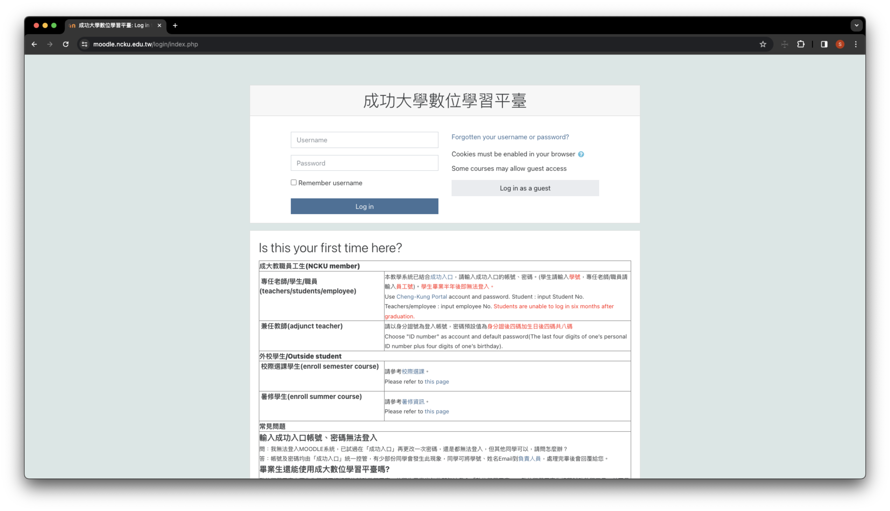
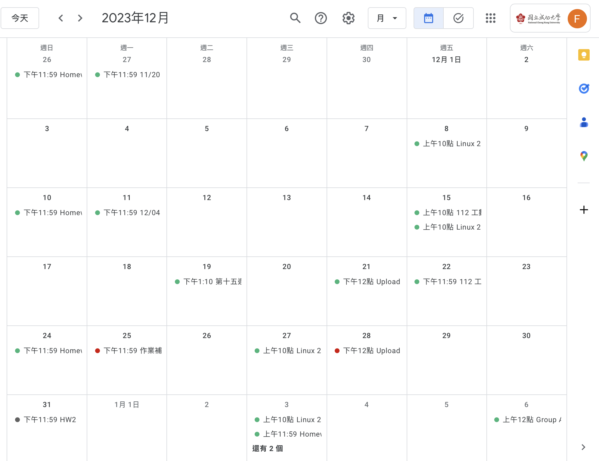
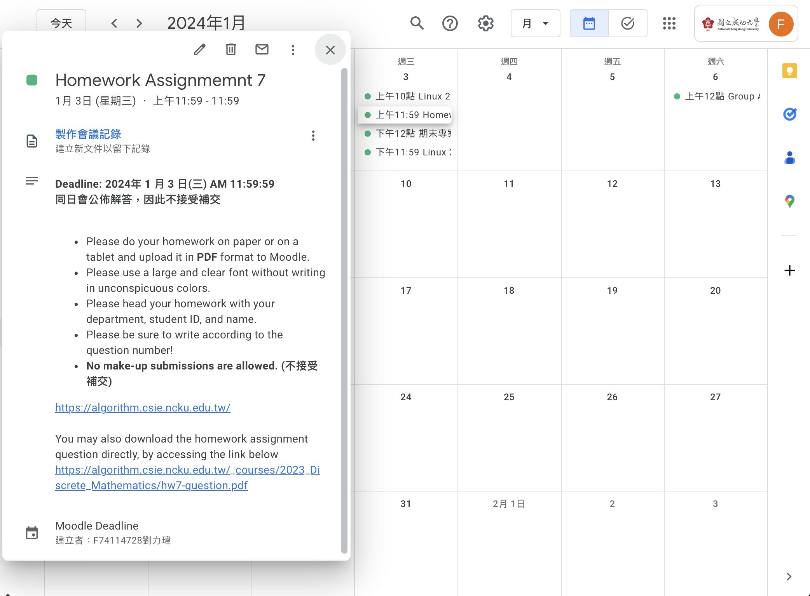

# Moodle Calendar
## Description
An application that syncs your NCKU Moodle assignments' info, deadline and submission status to Google Calendar.\
將你 NCKU Moodle 上的作業內容、截止日期、繳交狀態同步至 Google 行事曆。

## Usage
Step 1.

Download Moodle Calendar extension from [Chrome Web Store]() (Unavailable yet, pending Google's verification)\
從 [Chrome 線上應用程式商店]() 下載 Moodle Calendar 擴充功能（尚無法下載，正等待通過 Google 驗證）

Step 2.

Login NCKU Moodle\
登入 NCKU Moodle \

Step 3. 

Open the extention & click "Bind Account" \
開啟擴充功能並點選「綁定帳號」

Step 4.

After binding account, go back to Moodle and click "Sync". \
綁定帳號後，回到 Moodle 並點選「同步」。

Step 5.

After a few seconds, assignments will show up in your Google Calendar. Clicking it will show the information of that assignment \
Green: Submitted, Red: Not Submitted, Gray: Does not require submission \
等待幾秒後，作業內容便會顯示在你的 Google 行事曆上。點開來可以看到完整內容。 \
綠色：已繳交、紅色：未繳交、灰色：不需繳交 

